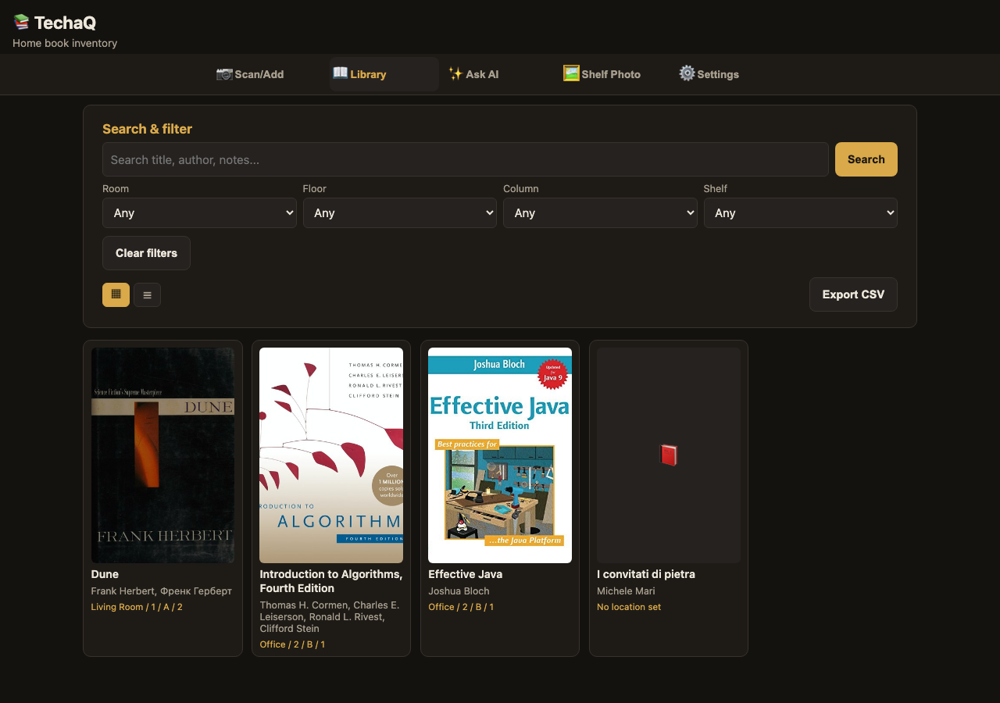

# TechaQ

A home book-collection inventory manager for the Arduino UNO Q. Scan a book's EAN/ISBN
barcode with a USB/Bluetooth HID scanner, add it manually, or photograph a shelf of spines
for OCR — TechaQ fetches cover art and synopsis from public book APIs, tracks each book's
physical location (room/floor/column/shelf), and lets you search by keyword or describe a
book in natural language via a local LLM. Every action gets an "IBM PC vibes" beep on an
optional Modulino Buzzer.

Built on the official `arduino:web_ui`, `arduino:dbstorage_sqlstore`, and `arduino:llm`
Bricks, plus a custom `ocr_runtime` Brick (Tesseract OCR).

*The Library view: cover art, authors, and shelf location fetched automatically from a barcode
scan, alongside a manually-added book still awaiting a location.*

## Running it

Deploy with the Arduino App CLI like any other app Brick bundle (`app.yaml` declares the
Bricks above and exposes port 7000). Once deployed, open the app's URL
(`http://<device-ip>:7000/`) in a browser, or use `python/cli.py` (via `docker exec` into the
running container) for a terminal-only workflow — both drive the exact same `engine/` code.

Every feature degrades gracefully if its dependency isn't available: no Modulino Buzzer means
silent operation, no local LLM means AI search reports itself unavailable, and no OCR brick
means shelf-photo review is disabled — the rest of the app is unaffected either way.

### Barcode scanner setup

Reading a USB/Bluetooth HID scanner requires a small host-side (outside the app container)
setup step — see [`host/README.md`](host/README.md) for the full walkthrough, including the
one-time `sudo apt-get install python3-evdev` a human has to run interactively on the board
and the systemd user service that runs `host/scanner_reader.py`.

## User guide

### Adding books

- **Scan**: plug in (or Bluetooth-pair) a HID barcode scanner — tested with an Eyoyo mini, but
  any HID-compliant scanner works, since they all enumerate as a keyboard and "type" the
  decoded digits. A scan POSTs to `/api/scan`, which looks up the code and auto-saves on a hit.
- **Manual**: fill in the Add Book form yourself — every field a scan would populate is
  editable, plus the four location fields.
- **Look up an ISBN**: type (or paste) an ISBN/EAN to preview its metadata before saving, or tap
  "Scan ISBN from photo" to photograph the barcode's printed digits instead of typing — the same
  `ocr_runtime` OCR pipeline reads the digits, offers up any plausible ISBN-looking candidates for
  you to pick, and fills the lookup field for you to confirm.
- **Shelf photo**: capture or upload a photo of several book spines. TechaQ preprocesses the
  image (grayscale/contrast, tries multiple rotations since spines are usually vertical), OCRs
  it via the `ocr_runtime` Brick, and asks the local LLM to pull out title/author guesses. Each
  guess is resolved against real book-search results and shown to you for review — nothing is
  saved until you confirm which candidates are real.

### Finding books

- **Keyword search** matches title, subtitle, authors, description, and notes.
- **Location filters** (room/floor/column/shelf) narrow the list to one physical spot.
- **"Describe it to find it"** lets you type a natural-language description (e.g. "that book
  about a kid wizard and his owl") — a local LLM turns it into a search-tool call and only ever
  returns real matches; it can never invent a book that doesn't exist in the search results.
- **Grid or list view** — toggle the Library between a cover-art grid and a compact table, and
  export whatever's currently displayed (after a search or filter) as a CSV file.

### Settings

- **Preferences** — pick the UI language (English, Italiano, Deutsch, Français, Español), switch
  between the dark (default) and light theme, and choose whether scanning/looking up a book
  fetches its synopsis automatically or leaves that for a manual "Fetch synopsis" button (shown
  on a book's lookup preview and detail view whenever its description is still empty). All three
  preferences are stored server-side, shared across every device viewing the app.
- **Import / export the whole library as CSV** — export every book to a CSV file, or import a
  CSV of books in that same format; rows whose ISBN already matches a book already in the
  library are skipped rather than duplicated.
- **Barcode scanner device exclusion** — exclude a misbehaving HID device (e.g. a real attached
  keyboard) from the host-side scanner-reading service; see [`host/README.md`](host/README.md).

### Editing and deleting

Every book's detail view is editable in place, including its location, and can be deleted from
the same screen.

## How it works

- **Engine.** `python/engine/library.py` is the one real code path for every book operation —
  `python/main.py` (WebUI) and `python/cli.py` (terminal) both call into it, so behavior can
  never diverge between the two front ends.
- **Metadata.** `python/engine/metadata.py` queries four sources concurrently by ISBN — Open
  Library, Google Books, and two national-library SRU catalogs (Deutsche Nationalbibliothek and
  Bibliothèque nationale de France, sharing one Dublin-Core XML parsing helper) — merging
  field-by-field (first non-empty value wins, longest description wins, cover falls back Open
  Library → Google thumbnail); `source` reports which of the four actually hit. Fetching the
  synopsis specifically is optional per-call (`include_description`), since Google Books is the
  only source that ever has one — the Settings "fetch synopsis automatically" toggle controls the
  default, and `fetch_description`/the manual "Fetch synopsis" button call Google Books alone.
  `search_by_title_author` backs both the AI-describe and OCR-candidate-resolution flows. A
  Google Books API key is optional.
- **Settings.** `python/engine/settings.py`'s `SettingsStore` persists one shared row (fetch-
  synopsis default, UI language, UI theme) in the same `techaq.db` SQLite file as the book table,
  via the same `arduino:dbstorage_sqlstore` wrapper — settings are server-side and common to
  every device viewing the app, not per-browser.
- **AI describe-to-find.** `python/engine/ai_search.py` wraps the `arduino:llm` Brick with a
  single `search_books` tool that calls the real metadata search — the model can only propose
  search terms, never fabricate a result. Defensive construction throughout: a missing/broken
  Brick degrades to "AI search unavailable" rather than crashing the app.
- **Shelf-photo OCR.** `bricks/ocr_runtime/` is a custom Brick (own Dockerfile, root-built,
  `apt-get install tesseract-ocr`) exposing a small HTTP OCR service, following the same shape
  as `scummvm-q`'s custom runtime Brick. `python/engine/ocr.py` preprocesses the image with
  Pillow, calls the service, and has the local LLM extract `{title, author}` candidates from
  the raw OCR text — explicitly allowed to say "unknown" rather than guess. The same
  preprocess/OCR pipeline backs photo-to-ISBN scanning, but pattern-matches digit runs instead
  of calling the LLM, since there's no free text to interpret.
- **CSV import/export.** `python/engine/library.py`'s `import_csv` parses rows with the stdlib
  `csv` module and adds each through the same `add_book` path as every other entry point,
  skipping (and counting) rows whose ISBN already exists in the library — export is a client-side
  reformatting of whatever's already loaded, so no separate backend route is needed for it.
- **Barcode scanner.** `host/scanner_reader.py` runs on the board's host OS (not inside the
  app container — HID input devices aren't reachable from in-container, see
  [`host/README.md`](host/README.md)) and POSTs decoded scans to the app's own `/api/scan`
  endpoint.
- **Buzzer.** `sketch/` runs on the paired MCU and drives a physical Modulino Buzzer via a
  single `play_tone(freq, ms)` Bridge RPC; `python/hw.py` calls it for scan/save/search/error/
  delete/startup tones tuned for "IBM PC speaker" vibes, degrading to silent operation with no
  buzzer/MCU attached.
- **Web UI.** `assets/` is a mobile-first responsive frontend served by the `arduino:web_ui`
  Brick, with real-time scan/save toasts over its Socket.IO channel. `assets/i18n.js` holds all
  five languages' strings and the `applyTranslations()`/`t()` machinery; every static label uses
  a `data-i18n*` attribute and every dynamic string (toasts, statuses) routes through `t()`. The
  light theme is a `[data-theme="light"]` CSS-variable override block in `style.css` — every
  other rule in the file already consumes those variables, so no other CSS changes were needed.
- **Installable app icon.** `assets/icons/` (favicon, Apple touch icon, and 192/512px "any" +
  "maskable" PNGs) plus `assets/manifest.json` mean "Add to Home Screen" on iOS, Android, and
  desktop Chrome saves TechaQ with its own book icon instead of a browser-tab screenshot;
  `index.html`'s `<link rel="manifest">`/`apple-touch-icon`/`theme-color` tags wire it up, and
  `applyTheme()` in `app.js` flips the `theme-color` meta alongside the CSS variables so the
  browser/status-bar chrome matches whichever theme is active.

## Tests

`pytest` covers `engine/` (metadata merge logic across all four sources, settings persistence,
AI search grounding, OCR text-cleanup, library CRUD) with no hardware/network/LLM dependency —
mocked HTTP and a stub LLM stand in for the real Bricks. There's no frontend test harness (i18n,
theming, and the Settings-UI wiring are verified live in-browser instead), consistent with how
every other frontend feature in this app has been verified.
